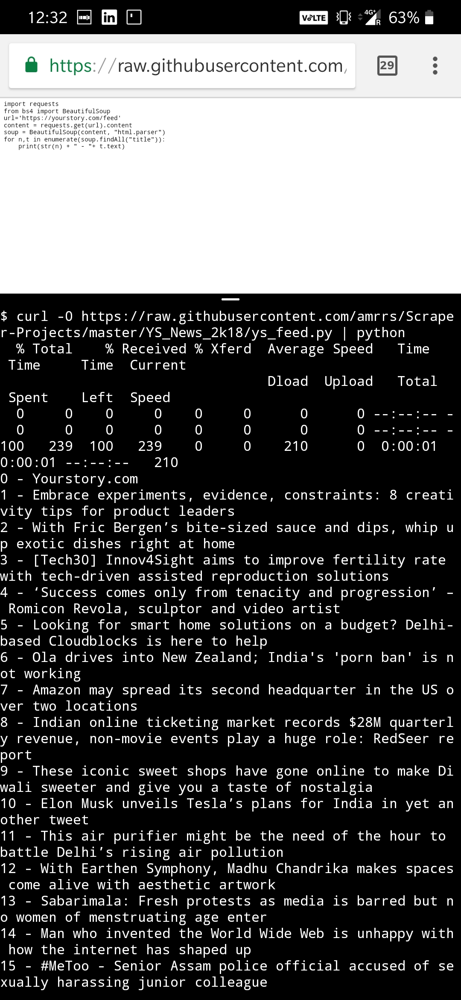

# Yourstory News Scraper

The screenshot below is to show this code being executed on an Android Device with `Termux` and required Python packages installed. 

### Code Exectution:

```bash
curl -0 https://raw.githubusercontent.com/amrrs/Scraper-Projects/master/YS_News_2k18/ys_feed.py | python3
```

### Screenshot of Android Phone running the above code


